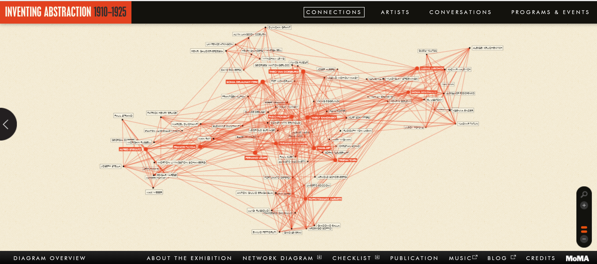
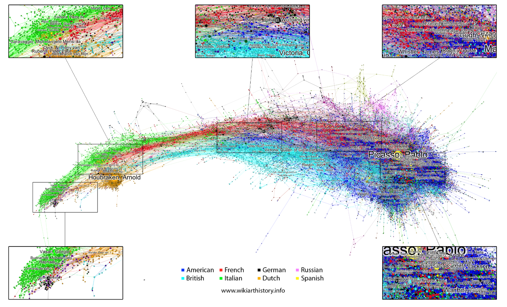

# No-artist-is-an-Island
Using network analysis to understand the social influences among the artists central to modern and contemporary art movements and styles -- who influenced them and who they influenced.

<H3>Introduction</H3>

In preparation for their 2013-4 exhibit -- <i>Inventing Modern Abstraction (1910-1925)</i> -- the Museum of Modern Art (MoMA) "analyzed the social and artistic relationships among key figures and modern artists in order to develop an interactive network diagram of the founders and pioneers of modern abstraction." Towards this end they provided an <a href="https://www.moma.org/interactives/exhibitions/2012/inventingabstraction/?page=connections">online interactive version</a> that was available for public use. A screenshot from the online version is shown below:

*Inventing Abstraction (MoMA)*"

This particular diagram followed in the footsteps of an earlier, often cited, and often imitated diagram created by Alfred H. Barr Jr., founding director of MoMA, and originally published in the catalogue for the Museum's 1936 exhibition “Cubism and Abstract Art.” This diagram can be found at a number of sites (and is included in this repository).

While both of these graphs involve relatively few artists and movements, there are other formal research studies with more extensive graphs and analyses of the relationships among collections of artists, as well as the movements of which they were a part. Of these, the most extensive is probably the series of related papers done by Doron Goldfarb et al. (see: <a href='https://arxiv.org/abs/1304.5629'>Art History on Wikipedia: A Macroscopic Observation</a>, <a href='https://www.mitpressjournals.org/doi/abs/10.1162/LEON_a_00773'>Collectivizing the Barr Model</a>, and <a href='https://arxiv.org/ftp/arxiv/papers/1304/1304.5629.pdf'>Comparing Art Historical Networks</a>). All of these papers revolve around an common dataset constructed in 2012 from the Getty Union List of Artist Names (ULAN) along with the designated relationships among these names and Wikipedia articles about these artists and the hypertext links among these articles. The set includes the names of artists dating to antiquity (e.g. early Greece) up to modern times. In total, the dataset included ~18K names and associated articles with ~4500 links among the ULAN names and ~54K links among the articles. One the network diagrams resulting from these data and covering a period from the 1400s (e.g. Da Vinci) to artists working in this century (e.g. Rauschenberg) is shown below:

*Visualization of Wikipedia Links < 75 years - Doron Goldfarb*

 
