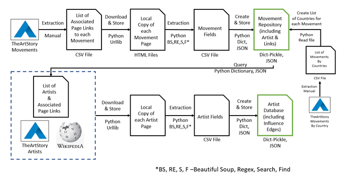

<h3>Introduction</h3>

"Social Network Analysis (SNA) can be described as the *study of human relations by means of graph theory*." Procedurally, in SNA we utilize graph theory -- a branch of mathematics -- to represent, detect, and interpret patterns of social ties or relations among a network of actors. The actors can be individuals, collections of individuals that share common attributes or characteristics (e.g. python programmers), or members of a social group (e.g. family members or friends). Basically, this means that SNA proceeds in two steps.  The first step is to produce a network graph of the relations where a *graph* is defined as a set of *nodes/vertices* and a set of *edges/lines* between pairs of nodes.  The second step is to utilize the graph and graph theory to better understand the patterns in the network (e.g. How connected is the network? Who are key actors? Are their major sub-groups among the actors? etc.).

SNA has a long history  

The primary object of SNA is a graph of the network of actors and relations. 

"detecting and interpreting patterns of social ties among the actors in a set of relations." The actors can be individuals or groups.

Basically, this means that SNA proceeds in to steps.  The first step is to produce a network graph of the relations.  Essentially, a graph is a collection of nodes The second step is to utilize the graph along with graph theory to visualize and analyze the relations.  In this case, the relations were talking about are the *influence* relationships among the artists of *Modern Art*.

<h3>Creating a Network Graph</3>

While there are a variety of online sources providing data and information that have described and specified the relations for individual artists during (curing various eras) there are few that have combined them into an 

So, the first goal of this project is to create a SNA graph of the *influence* relationships among the artists of *Modern Art* that can be used for SNA analysis and visualizati

Ultimately, the primary goal of our "processing pipeline" (to borrow a phrase from Goldfarb et.al.) is to use data from The ArtStory to create an SNA graph of the influences

*Data Scraping The ArtStory Pages for Movements and Artists*

